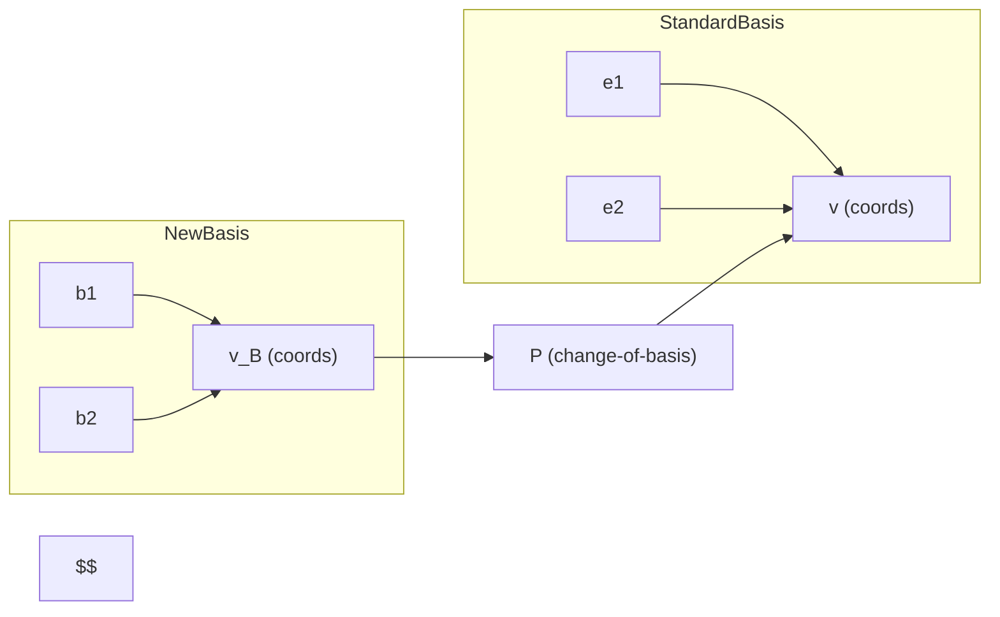

# Slides — Session 1 (Markdown slide-style)

---  
## Slide: What is Linear Algebra?
- Language for vectors, matrices, linear maps
- Relevance to data science & ML

---  
## Slide: Vector basics
- Definitions & operations
- Dot product, norm, orthogonality

---  
## Slide: Vector space & basis
- Span, linear independence, basis, dimension

---  
## Slide: Change of basis (diagram)

---  
## Slide: Matrix types & examples
- Identity, diagonal, symmetric, orthogonal
- Example: rotation matrix in 2D
$$
R(\theta)=\begin{bmatrix}\cos\theta & -\sin\theta\\ \sin\theta & \cos\theta\end{bmatrix}
$$

---  
## Slide: Projection & least squares (formula)
- Projection matrix $P = A(A^T A)^{-1} A^T$
- Least squares solution $\hat x = (A^T A)^{-1} A^T b$

---  
## Slide: Applications
- PCA, linear regression, image transforms, embeddings

---  
## Slide: References & next session
- Strang ch.1–2, numpy docs